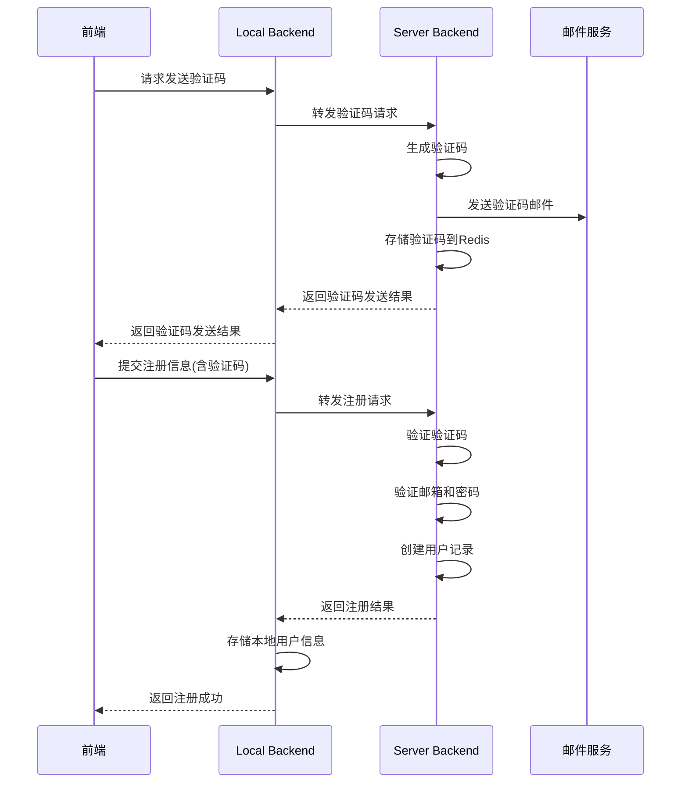
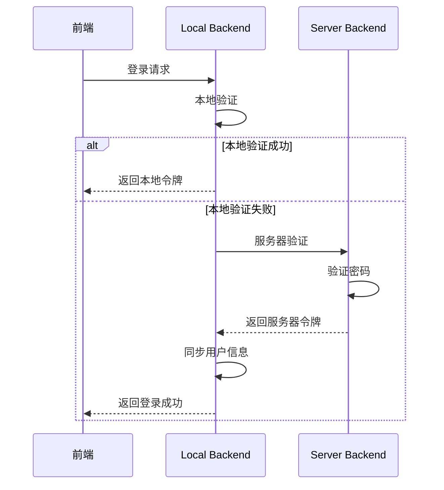
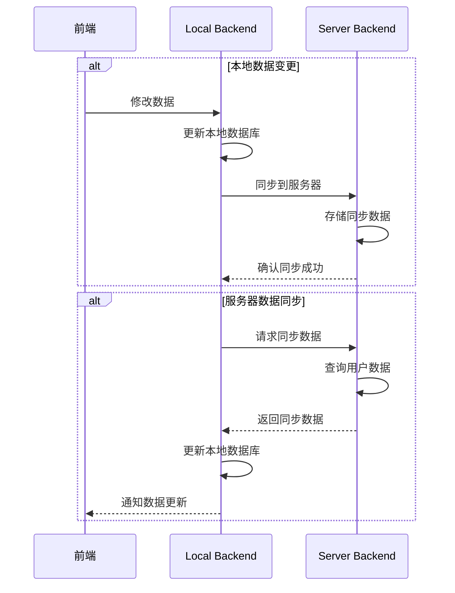
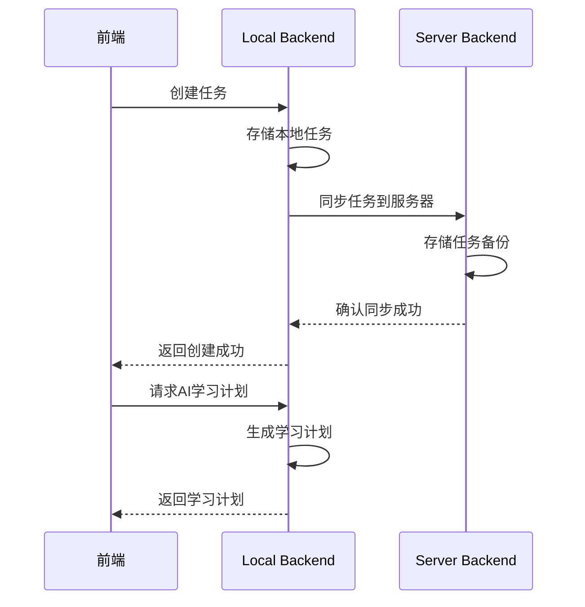
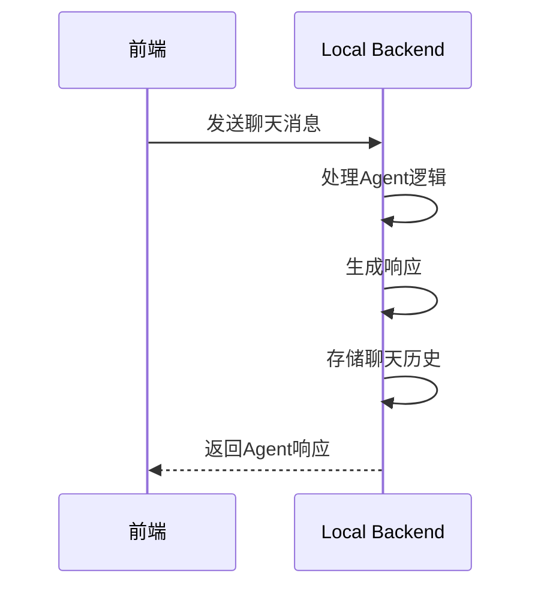

[](https://classroom.github.com/a/py413vYq)
https://kcnshyb9xgl3.feishu.cn/wiki/VOTmwDTd1ipr9JkpZ27cW0BCnrb 就是feishu

## 项目进度
已完成以下功能：
- ✅ Local Backend 和 Server Backend 基本框架
- ✅ 用户认证系统（注册/登录）
- ✅ 日程管理（完整CRUD）
- ✅ 任务管理（完整CRUD）
- ✅ 数据库集成（SQLite）
- ✅ 数据同步机制（Local ↔ Server）
- ✅ AI助手功能
- ✅ 验证码服务（基于数据库实现）

正在开发中：
- 🔄 寻友匹配功能
- 🔄 文件管理功能

## 项目架构

# SUSTech Student Productivity Agent

## 项目概述

SUSTech Student Productivity Agent 是一个为南方科技大学学生设计的智能生产力助手，采用 **Local + Server** 双后端架构，提供本地离线功能和服务器同步备份能力。

## 系统架构

### 整体架构

```
┌─────────────────────────┐       ┌─────────────────────────┐
│                         │       │                         │
│  Local Backend          │◄──────►  Server Backend         │
│  (用户设备本地)         │       │  (服务器端)             │
│                         │       │                         │
├─────────────────────────┤       ├─────────────────────────┤
│  - 本地数据存储         │       │  - 用户认证             │
│  - 核心业务逻辑         │       │  - 数据同步             │
│  - 离线功能             │       │  - 远程备份             │
│  - 实时同步             │       │  - 安全管理             │
│                         │       │  - 邮件服务             │
└─────────────────────────┘       └─────────────────────────┘
```

### 架构分工

| 组件 | 职责 | 部署位置 | 技术栈 |
|------|------|----------|--------|
| **Local Backend** | 本地数据存储、核心业务逻辑、离线功能 | 用户设备本地 | FastAPI + SQLite |
| **Server Backend** | 用户认证、数据同步、远程备份、邮件服务 | 服务器端 | FastAPI + SQLite (可替换为PostgreSQL) |

## 核心功能

### 功能模块分配

| 功能 | Local Backend | Server Backend |
|------|--------------|---------------|
| 用户注册/登录 | ✅ (本地验证 + 服务器同步) | ✅ (密码验证 + 验证码) |
| 日程管理 | ✅ (完整CRUD) | ✅ (同步备份) |
| 任务管理 | ✅ (完整CRUD) | ✅ (同步备份) |
| AI助手 | ✅ (完整功能) | ❌ (本地实现) |
| 文件管理 | ✅ (本地存储) | ❌ (本地实现) |
| 数据同步 | ✅ (发起同步) | ✅ (接收同步) |
| 验证码服务 | ❌ (调用Server) | ✅ (邮件发送 + 验证) |

## 系统流程

### 1. 用户注册流程 (验证码版本)



### 2. 用户登录流程



### 3. 数据同步流程



### 4. 任务管理流程



### 5. AI助手流程



## 部署流程

### 1. 本地开发环境部署

#### Local Backend

```bash
# 进入目录
cd local_backend

# 安装依赖
pip install -r requirements.txt

# 配置环境变量
copy .env.example .env

# 初始化数据库
python init_db.py

# 启动服务
uvicorn main:app --reload --host 0.0.0.0 --port 8000
```

#### Server Backend

```bash
# 进入目录
cd server_backend

# 安装依赖
pip install -r requirements.txt

# 配置环境变量
copy .env.example .env

# 初始化数据库
python init_db.py

# 启动服务
uvicorn main:app --reload --host 0.0.0.0 --port 8001
```

### 2. 生产环境部署

#### Local Backend
- 使用PyInstaller打包为可执行文件
- 配置为系统服务自动启动
- 定期备份本地数据库文件

#### Server Backend
- 部署在云服务器上
- 使用PostgreSQL数据库
- 配置Gunicorn + Nginx
- 启用HTTPS
- 配置监控和日志管理
- 配置有效的SMTP服务用于发送验证码

## 系统集成

### 前端集成

前端应用可以通过以下方式集成：

1. **Local Backend API**：http://localhost:8000
2. **Server Backend API**：http://localhost:8001 (开发环境)

### API文档

- **Local Backend**：http://localhost:8000/docs
- **Server Backend**：http://localhost:8001/docs

### 环境变量配置

| 配置项 | Local Backend | Server Backend | 说明 |
|--------|---------------|----------------|------|
| APP_NAME | ✅ | ✅ | 应用名称 |
| APP_VERSION | ✅ | ✅ | 应用版本 |
| DEBUG | ✅ | ✅ | 调试模式 |
| LOG_LEVEL | ✅ | ✅ | 日志级别 (DEBUG/INFO/WARNING/ERROR) |
| DATABASE_URL | ✅ | ✅ | 数据库连接字符串 |
| SECRET_KEY | ✅ | ✅ | JWT密钥 |
| ALGORITHM | ✅ | ✅ | JWT算法 |
| ACCESS_TOKEN_EXPIRE_MINUTES | ✅ | ✅ | 令牌过期时间 |
| CORS_ORIGINS | ✅ | ✅ | CORS允许的源 |
| SERVER_BACKEND_URL | ✅ | ❌ | 服务器后端地址 |
| TEST_MODE | ❌ | ✅ | 测试模式，跳过邮件发送 |
| SKIP_VERIFICATION | ❌ | ✅ | 跳过验证码验证 |
| SKIP_RATE_LIMIT | ❌ | ✅ | 跳过频率限制 |

| SMTP_HOST | ❌ | ✅ | SMTP服务器地址 |
| SMTP_PORT | ❌ | ✅ | SMTP端口 |
| SMTP_USER | ❌ | ✅ | SMTP用户名 |
| SMTP_PASSWORD | ❌ | ✅ | SMTP密码 |
| SMTP_FROM_EMAIL | ❌ | ✅ | 发件人邮箱 |
| SMTP_FROM_NAME | ❌ | ✅ | 发件人名称 |
| VERIFICATION_CODE_LENGTH | ❌ | ✅ | 验证码长度 |
| VERIFICATION_CODE_EXPIRE_MINUTES | ❌ | ✅ | 验证码过期时间(分钟) |
| RATE_LIMIT_MAX_REQUESTS | ❌ | ✅ | 频率限制最大请求数 |
| RATE_LIMIT_WINDOW_MINUTES | ❌ | ✅ | 频率限制时间窗口(分钟) |

## 验证码系统说明

### 1. 验证码流程

1. **发送验证码**：前端调用 `/auth/verification/send` 接口，提供邮箱地址和用途（register/reset_password）
2. **接收验证码**：系统生成6位数字验证码，发送到用户邮箱
3. **验证验证码**：用户在注册或重置密码时提交验证码
4. **验证结果**：系统验证验证码是否正确且未过期

### 2. 测试模式

在开发环境中，可以启用测试模式来绕过邮件发送：

```env
TEST_MODE=true
```

启用测试模式后：
- 系统会生成验证码但不会发送邮件
- 响应中会包含 `test_code` 字段，直接返回生成的验证码
- 方便开发和测试时使用

### 3. 跳过验证码验证

在开发环境中，可以跳过验证码验证：

```env
SKIP_VERIFICATION=true
```

启用后，注册和重置密码时不需要验证码即可完成操作。

### 4. 跳过频率限制

在开发环境中，可以跳过频率限制：

```env
SKIP_RATE_LIMIT=true
```

启用后，系统不会限制验证码发送的频率，方便测试。

## 系统监控

### 健康检查

- **Local Backend**：http://localhost:8000/health
- **Server Backend**：http://localhost:8001/health

### 日志管理

项目采用统一的日志系统，支持以下日志级别：

| 级别 | 说明 | 使用场景 |
|------|------|----------|
| **DEBUG** | 调试信息 | 开发阶段详细调试，记录变量值、函数调用等 |
| **INFO** | 一般信息 | 记录正常运行状态、关键操作完成等 |
| **WARNING** | 警告信息 | 记录潜在问题、异常情况但不影响系统运行 |
| **ERROR** | 错误信息 | 记录严重错误、异常堆栈等，需要关注和修复 |

#### 日志配置

在 `.env` 文件中设置日志级别：

```env
LOG_LEVEL=INFO
```

#### 日志级别过滤规则

日志级别采用"**包含式**"过滤机制，设置某个级别后，会输出该级别及以上的所有日志类型：

| 设置的级别 | 输出的日志类型 | 适用场景 |
|------------|----------------|----------|
| **DEBUG** | DEBUG + INFO + WARNING + ERROR（全部） | 开发调试阶段，需要详细日志 |
| **INFO** | INFO + WARNING + ERROR | 正常运行环境，记录关键操作 |
| **WARNING** | WARNING + ERROR | 生产环境，仅关注警告和错误 |
| **ERROR** | 仅 ERROR | 生产环境，仅记录严重错误 |

**示例**：

```python
# 设置 LOG_LEVEL=DEBUG 时
logger.debug("这是调试信息")    # ✅ 会输出
logger.info("这是一般信息")     # ✅ 会输出
logger.warning("这是警告")      # ✅ 会输出
logger.error("这是错误")        # ✅ 会输出

# 设置 LOG_LEVEL=INFO 时
logger.debug("这是调试信息")    # ❌ 不会输出（被过滤）
logger.info("这是一般信息")     # ✅ 会输出
logger.warning("这是警告")      # ✅ 会输出
logger.error("这是错误")        # ✅ 会输出
```

#### 日志输出

- **控制台输出**：实时显示到控制台
- **文件输出**：自动写入 `logs/` 目录，按日期分割
- **日志文件命名**：`{app_name}_{yyyy-mm-dd}.log`
- **日志滚动**：单个文件最大10MB，保留最近5个备份

#### 日志格式

```
2024-01-15 10:30:45,123 - server_backend - INFO - auth_service:45 - 用户登录成功: user_id=test@example.com
```

格式说明：`{时间戳} - {应用名称} - {日志级别} - {模块:行号} - {日志消息}`

#### 日志文件位置

- **Local Backend**：`local_backend/logs/`
- **Server Backend**：`server_backend/logs/`

## 安全考虑

1. **数据安全**：
   - 密码在服务器端验证和存储
   - 本地存储加密后的密码
   - 传输使用HTTPS

2. **认证安全**：
   - JWT令牌认证
   - 令牌过期机制
   - 防暴力攻击措施
   - 验证码频率限制

3. **数据保护**：
   - 本地数据文件权限控制
   - 服务器数据备份
   - 数据传输加密

## 性能优化

1. **Local Backend**：
   - 本地缓存
   - 延迟加载
   - 批处理操作

2. **Server Backend**：
   - 数据库索引优化
   - 缓存机制
   - 异步处理

## 扩展规划

1. **功能扩展**：
   - 多语言支持
   - 第三方服务集成
   - 高级AI功能

2. **架构扩展**：
   - 微服务架构
   - 容器化部署
   - 负载均衡

3. **技术升级**：
   - 数据库迁移到PostgreSQL
   - 引入缓存系统
   - 实现消息队列

## 开发指南

### 代码结构

```
team-project-26spring-26s-27/
├── local_backend/         # 本地后端
│   ├── database/         # 数据库层
│   ├── business/         # 业务层
│   ├── service/          # 服务层
│   ├── presentation/     # 表现层
│   ├── config.py         # 配置文件
│   ├── main.py           # 应用入口
│   ├── init_db.py        # 数据库初始化
│   ├── requirements.txt  # 依赖包
│   └── README.md         # 本地后端文档
├── server_backend/        # 服务器后端
│   ├── database/         # 数据库层
│   ├── business/         # 业务层
│   │   └── email_service.py  # 邮件和验证码服务
│   ├── service/          # 服务层
│   ├── presentation/     # 表现层
│   ├── config.py         # 配置文件
│   ├── main.py           # 应用入口
│   ├── init_db.py        # 数据库初始化
│   ├── requirements.txt  # 依赖包
│   └── README.md         # 服务器后端文档
└── README.md            # 整体流程文档
```

### 开发流程

1. **环境搭建**：
   - 安装Python 3.13
   - 安装依赖包
   - 配置环境变量

2. **代码开发**：
   - 遵循四层架构
   - 编写单元测试
   - 代码风格一致

3. **测试**：
   - 运行API测试
   - 验证功能完整性
   - 检查性能和安全

4. **部署**：
   - 本地测试
   - 服务器部署
   - 监控和维护

## 故障排除

### 常见问题

1. **依赖兼容性**：
   - Python 3.13需要特定版本的依赖
   - 已固定pydantic==1.10.12和sqlalchemy==1.4.50

2. **同步失败**：
   - 检查网络连接
   - 验证服务器地址配置
   - 查看同步日志

3. **认证问题**：
   - 检查JWT密钥配置
   - 验证用户凭证
   - 查看认证日志

4. **数据库问题**：
   - 检查数据库连接字符串
   - 验证数据库权限
   - 查看数据库日志

5. **验证码问题**：
   - 验证SMTP配置是否正确
   - 查看邮件发送日志
   - 开发环境可启用TEST_MODE绕过邮件发送

6. **频率限制问题**：
   - 开发环境可启用SKIP_RATE_LIMIT绕过频率限制

## 贡献指南

1. **代码贡献**：
   - 遵循代码风格
   - 编写测试用例
   - 提交Pull Request

2. **文档贡献**：
   - 更新README文件
   - 编写API文档
   - 完善开发指南

3. **问题反馈**：
   - 提交Issue
   - 提供详细的错误信息
   - 建议改进方案

## 许可证

MIT License