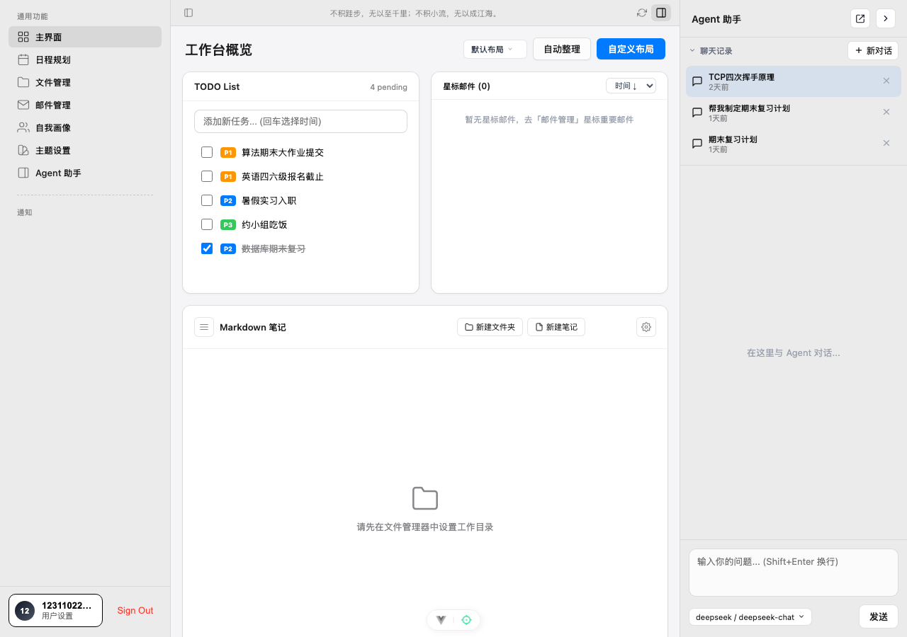
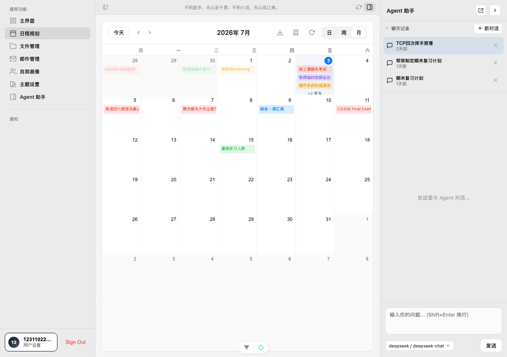
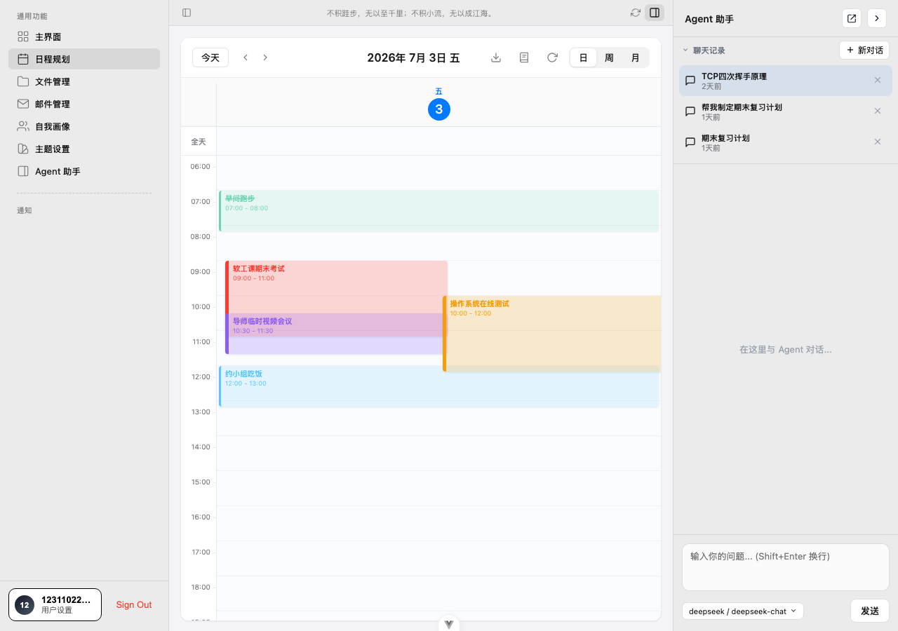
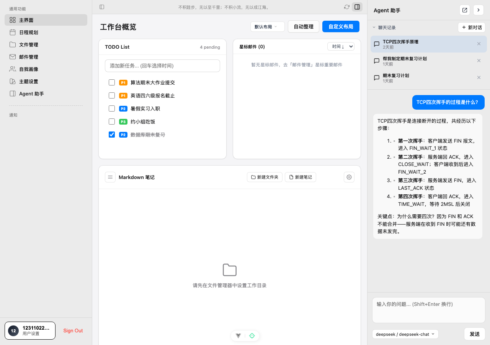
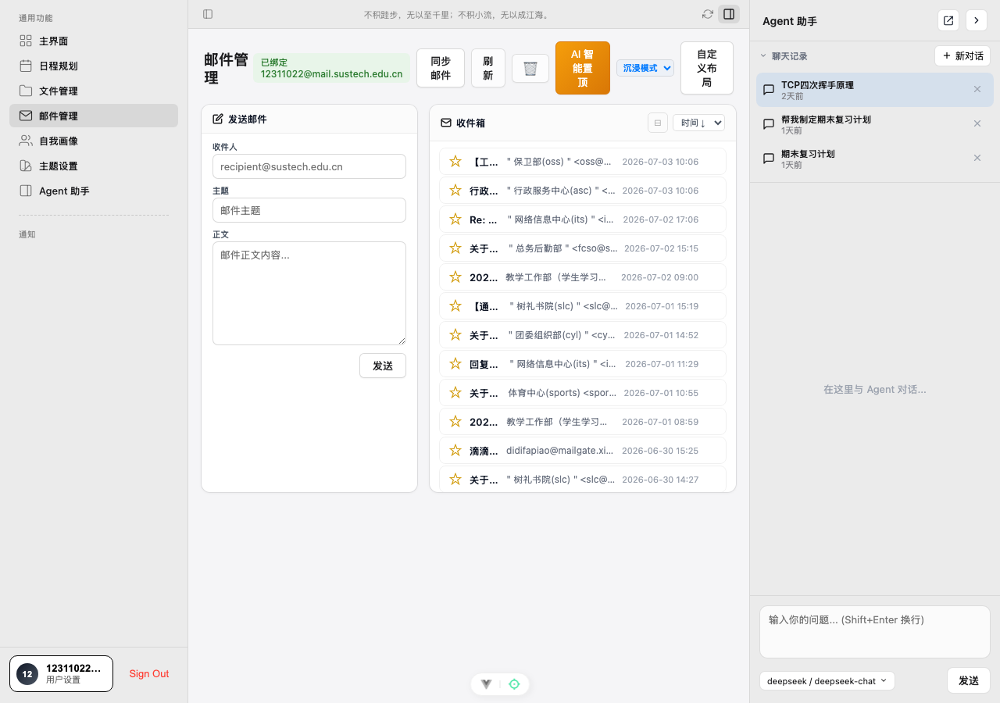
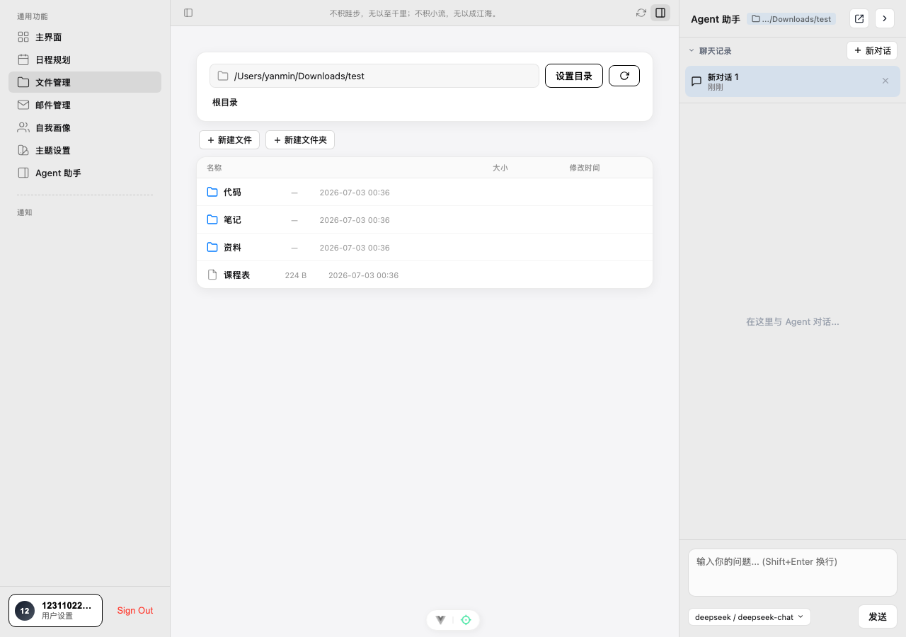
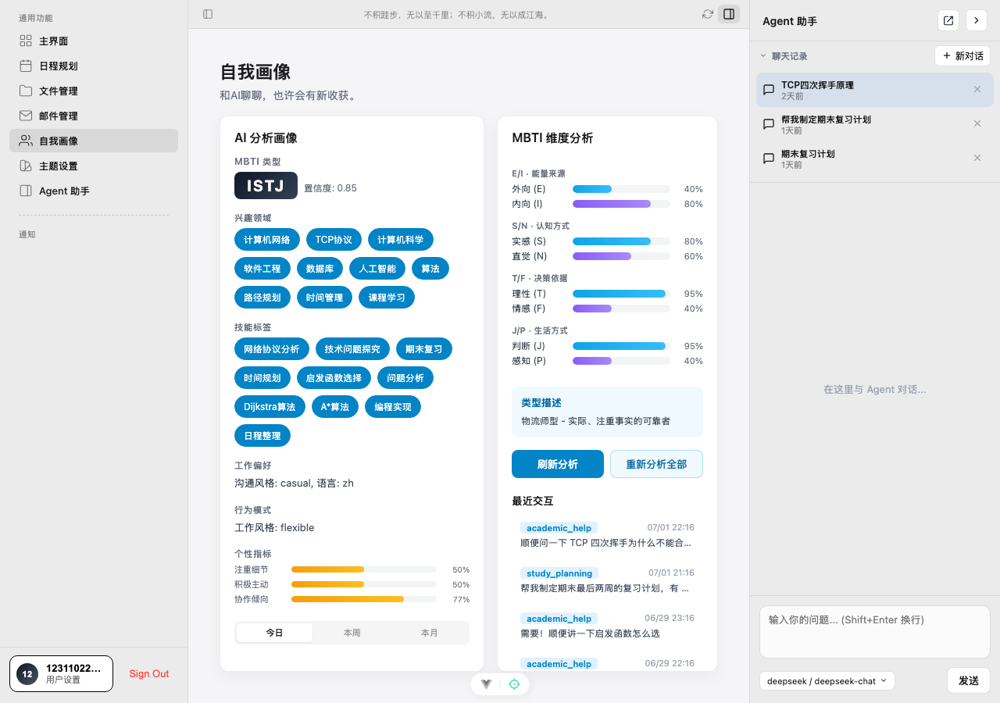
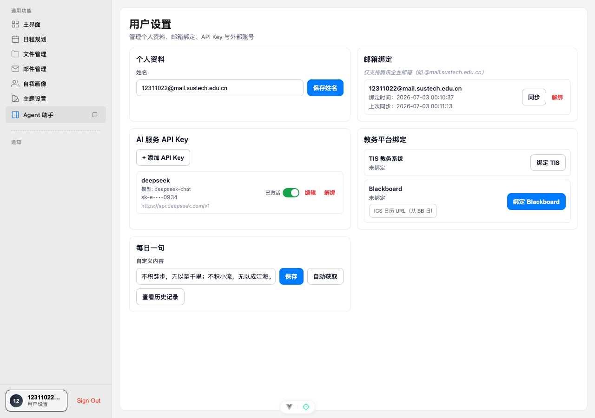
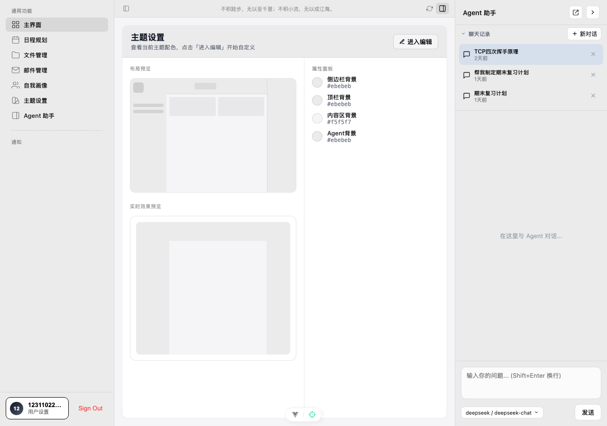

# ProAgent — 智能协作工作台

个人全栈项目，将日程、任务、邮件、文件、AI 对话和个人画像整合进一个桌面级 Web 应用。前端 Vue3，后端双服务架构（本地 FastAPI + 远程同步服务），支持 Tauri 打包为桌面应用。


## 截图

| 登录 | 工作台 |
|------|--------|
|  |  |

| 日程 · 月视图 | 日程 · 周视图 |
|--------------|--------------|
|  |  |

| 日程 · 日视图（同时段事件并排） | Agent 助手 |
|-------------------------------|-----------|
|  |  |

| 邮件管理 | 文件管理 |
|---------|---------|
|  |  |

| 自我画像 · MBTI 分析 | 用户设置 |
|--------------------|---------|
|  |  |

| 主题设置 | |
|---------|--|
|  | |

## 功能

**工作台**：可拖拽卡片布局，包含待办清单、星标邮件、Markdown 笔记本、每日一句。

**日程规划**：月/周/日三视图，支持同时段事件自动并排（Apple Calendar 风格布局算法），可拖拽调整时间，全天事件独立行，待办事项联动。

**邮件管理**：绑定 IMAP 邮箱（支持腾讯企业邮），本地同步收件箱，AI 智能置顶，内置发件界面。

**文件管理**：指定本地目录作为工作区，支持 Markdown 文件在线预览/编辑、新建/重命名/删除、文件夹导航。

**Agent 助手**：侧边浮层对话，多会话历史，接入 DeepSeek / 其他 OpenAI 兼容模型，支持流式回复。

**自我画像**：基于对话历史自动推断 MBTI 类型（LLM 分析），展示兴趣领域、技能标签、行为模式、使用热力图。

**主题设置**：实时预览自定义配色方案，应用到全局布局。

**用户设置**：邮箱绑定、AI 服务 API Key 管理（支持多 provider）、每日一句自定义、教务平台绑定入口。

## 架构

```
前端 (Vue3 · :5173)
        │
        ├──► Local Backend (FastAPI · :8002)
        │       ├─ 日程 / 任务 / 文件 / AI 对话 / 自我画像
        │       └─ SQLite 本地库
        │
        └──► Server Backend (FastAPI · :8001)
                ├─ 用户认证 / 邮件同步
                └─ SQLite 服务端库
```

Local Backend 处理所有核心功能，离线可用；Server Backend 负责账户注册登录与邮件 IMAP 代理。AI 能力通过 `config.json` 配置 provider，默认支持 DeepSeek。

## 快速开始

**环境要求**：Python 3.10+、Node.js 18+

```bash
# 1. 初始化数据库
cd local_backend && python database/code/database_init.py && cd ..
cd server_backend && python database/code/database_init.py && cd ..

# 2. 配置 AI provider（可选，不配则 Agent 功能不可用）
# 在项目根目录创建 config.json：
# {
#   "providers": { "deepseek": { "apiKey": "sk-xxx", "apiBase": "https://api.deepseek.com/v1" } },
#   "agent": { "model": "deepseek-chat", "provider": "deepseek" }
# }

# 3. 启动后端
cd local_backend && pip install -r requirements.txt
uvicorn main:app --port 8002 &
cd ../server_backend && pip install -r requirements.txt
uvicorn main:app --port 8001 &

# 4. 启动前端
cd frontend && npm install && npm run dev
```

访问 http://localhost:5173

### Tauri 桌面版

```bash
cd frontend && npm install && cd ..
pip install pyinstaller
bash scripts/build_and_run.sh
# 输出：frontend/src-tauri/target/release/bundle/dmg/ProAgent_*.dmg
```

### Docker

```bash
docker compose up -d
# 前端: http://localhost
# Local API: http://localhost:8002/docs
# Server API: http://localhost:8001/docs
```

## API 文档

启动后访问：
- Local Backend：http://localhost:8002/docs
- Server Backend：http://localhost:8001/docs

## 技术栈

| | 技术 | 版本 |
|-|------|------|
| 前端框架 | Vue | 3.5.29 |
| 构建工具 | Vite | 7.3.1 |
| 状态管理 | Pinia | 3.0.4 |
| 布局 | vue3-grid-layout | 1.0.0 |
| 图表 | ECharts | 6.x |
| 桌面壳 | Tauri | 2.x |
| 后端框架 | FastAPI | 0.100+ |
| 数据库 | SQLite | 3 |
| ORM | SQLAlchemy | 2.0+ |
| 认证 | JWT | — |

## CI/CD

Push 到 `main` / `integration` 分支自动触发：

| 阶段 | 内容 |
|------|------|
| Compile | Python 语法检查 + Vite 构建 |
| Test | pytest（含覆盖率）+ vitest + flake8 |
| Package | 打包 Local / Server 制品上传 Artifacts |
| Docs | pdoc3 生成 API HTML 文档 |
| Docker | 构建镜像 + docker-compose 测试 + 推送 GHCR |
| Kubernetes | kubeconform 清单验证 + kind 集群部署测试 |
