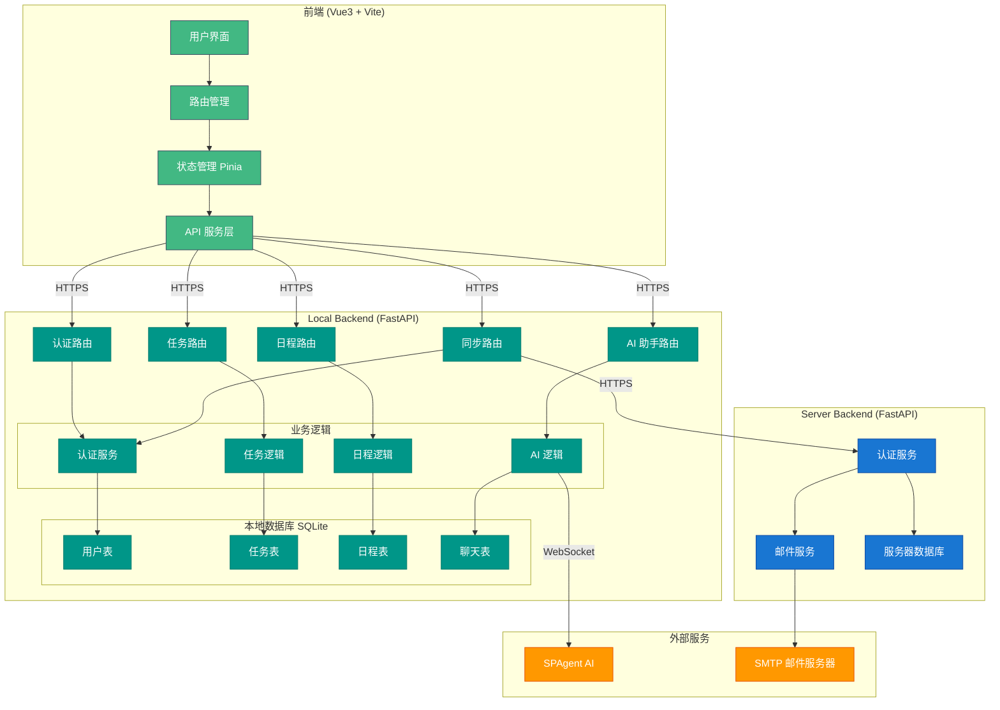
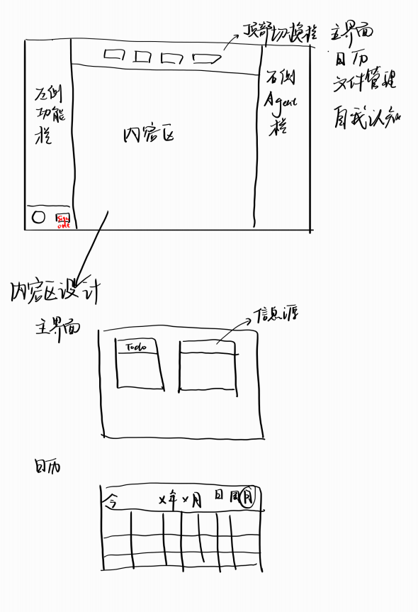
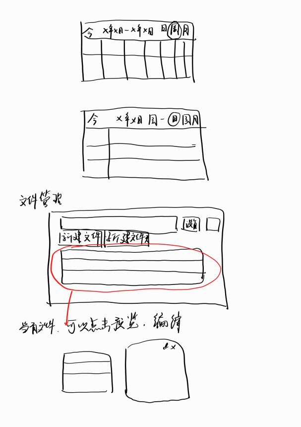
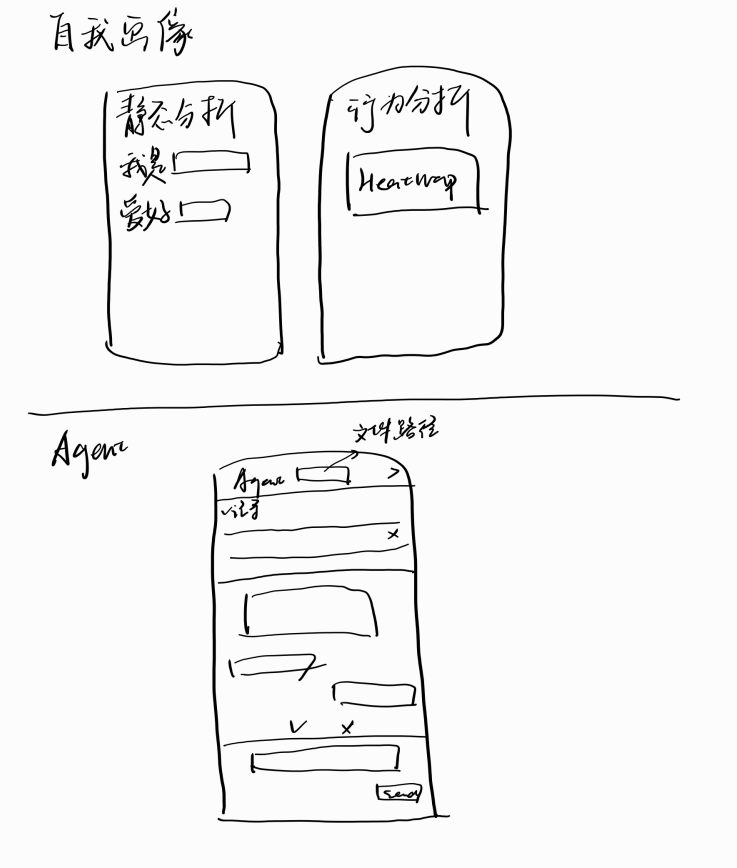
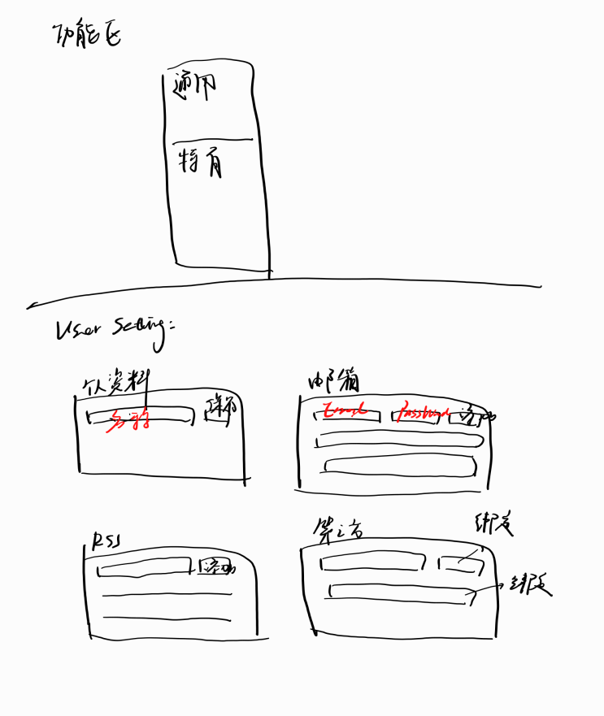

# 1，架构设计

## 图示



## 架构说明

### 三层架构

| 层级 | 技术 | 职责 |
|------|------|------|
| **前端** | Vue3 + Vite + Tauri | 用户界面、路由、状态管理 |
| **Local Backend** | FastAPI + SQLite | 本地数据存储、核心业务逻辑、离线功能 |
| **Server Backend** | FastAPI + SQLite | 用户认证、数据同步、邮件服务 |

### 数据流向

```
前端 ←→ Local Backend ←→ Server Backend
           ↓
      SPAgent
```

### 关键设计决策

1. **Local-First 架构**：核心数据存储在本地，保证离线可用
2. **双向同步**：Local ↔ Server 数据同步机制
3. **AI 集成**：通过 WebSocket 连接 SPAgent 提供智能对话

### 架构解释

#### 为何采用此架构

1. **隐私优先**：学生生产力数据（日程、任务、笔记）属于敏感信息，Local-First 架构确保核心数据存储在用户设备本地，减少数据泄露风险
2. **离线可用性**：学生在校园网不稳定或无网络环境下仍能正常使用任务管理、日程查看等核心功能
3. **低延迟体验**：本地数据库操作响应时间远低于网络请求，提供流畅的用户体验
4. **可扩展性**：前后端分离 + 双后端架构允许独立扩展各组件，便于后续添加新功能

#### 图中未体现的隐含假设

1. **网络假设**：同步功能依赖网络连接，Local Backend 与 Server Backend 之间的数据同步需要稳定的网络环境
2. **安全假设**：JWT Token 用于认证，假设客户端安全存储 Token，HTTPSS 用于传输加密
3. **数据一致性**：双向同步机制假设冲突解决策略为"最后写入优先"，未处理复杂的冲突合并场景
4. **AI 服务可用性**：SPAgent 作为外部服务，假设其始终可用，未实现降级策略（如 AI 不可用时回退到本地规则引擎）
5. **单设备假设**：当前架构假设用户主要在单一设备上使用，多设备同步场景下的数据冲突处理尚未完善

#### 技术选型理由

1. **Vue3 + Vite**：现代前端框架，组件化开发，Vite 提供快速热更新
2. **FastAPI**：Python 异步框架，自动生成交互式 API 文档，类型安全
3. **SQLite**：轻量级嵌入式数据库，无需额外部署，适合本地存储场景
4. **WebSocket**：用于 AI 对话的实时流式响应，提供类似聊天的交互体验

# 2，UI设计

## 整体布局结构




## calendar




## self



## file_management


